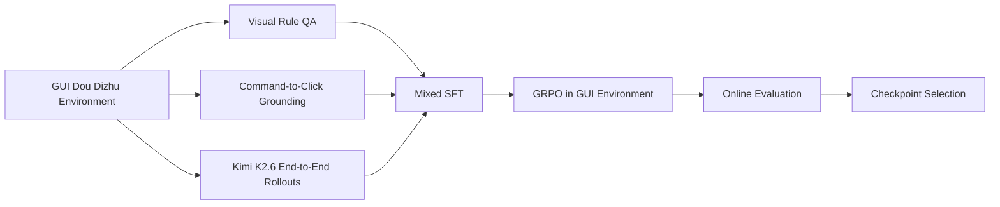

# Post-Training a Dou Dizhu GUI Agent Model

本项目训练了一个基于视觉的斗地主 GUI Agent。我把斗地主游戏做成了视觉 GUI agent 环境，在此环境下使用数据合成、SFT、GRPO 强化学习的完整 agentic 后训练流程训练了 Qwen3.5 4B 模型。经过严格评测，训练后的模型端到端能力远超基座模型和 teacher 模型 Kimi K2.6。完成了一个针对特定任务的 agentic post-training 从环境设计到模型指标提升的完整落地过程。

<p align="center">
  <video src="https://github.com/user-attachments/assets/a2a855bb-d3eb-484c-9abd-8d536eca81a6" controls muted autoplay loop playsinline width="80%"></video>
</p>

视频展示的是模型在斗地主 GUI 中读取截图、生成牌局分析、选择语义动作、输出鼠标点击坐标，并通过环境执行点击推进牌局的过程。

**Tech Stack**：强化学习、veRL、vLLM、FSDP、数据合成、SFT、Agent、Ray
**Hardware**：2 $\times$ NVIDIA RTX PRO 6000 96GB 

## 1. What This Project Does

我训练的是像一个真正的人一样，“用眼睛看”，“大脑思考与记忆”，“点击鼠标”，“同时聊天”的 斗地主 GUI agent model。每一轮，模型只接收当前系统提示词、游戏截图和上一轮自己留下的短记忆，然后必须一次性输出五类内容：

- `<plan>`：对当前局势的简短分析。
- `<action>`：语义出牌动作，例如 `[3, 3]`、`[10, J, Q, K, A]`、`[pass]`。
- `<tool_call>`：归一化 GUI 点击坐标，例如 `left_click([55,850],[100,860],[430,755])`。
- `<chat>`：面向演示 UI 的一句自然语言反馈。
- `<memory>`：留给下一轮的短期记忆。

示例输出：

```xml
<plan>当前我是地主，需要先压低小牌并保留高牌控制权。</plan>
<action>[3, 3]</action>
<tool_call>left_click([55,850],[100,860],[430,755])</tool_call>
<chat>先走一对小牌试探一下。</chat>
<memory>已出一对3，后续保留高牌控场。</memory>
```

环境会解析 `tool_call`，把点击坐标投影到 GUI 游戏界面，再还原成斗地主规则动作。如果动作合法，牌局继续推进；如果动作无法执行，环境会记录失败原因，并用 fallback 保证 episode 可以继续结束，便于稳定训练和评测。

## 2. Why It Is Non-Trivial

这不是单纯的“会不会斗地主规则”问题，而是一个视觉感知、规则推理、GUI grounding 和多轮策略共同耦合的任务。

| 难点 | 具体挑战 |
|---|---|
| 视觉读牌 | 模型需要从截图识别自己的手牌、其他玩家出牌、剩余牌数、地主身份和按钮状态。 |
| 游戏推理 | 斗地主有特定规则，模型必须根据规则进行推理；动作空间复杂，顺子、连对、飞机、炸弹、王炸、带牌关系都要和当前牌局上下文对齐。 |
| GUI grounding | 语义动作不能直接执行，必须映射到正确牌面和按钮的坐标位置，且点击顺序要正确。 |
| 长程决策 | 单步点击正确不等于会赢整局，模型需要在多轮反馈中学会减少无效动作、推进手牌并保留关键牌。 |
| 训练稳定性 | 环境既要严格记录模型失败，又不能让大量非法点击直接中断 rollout。 |

原始 Qwen3.5-4B / 9B 在完整游戏且几乎无法自主推进手牌，说明仅靠基座模型能力不能自然解决这个 GUI agent 任务。

## 3. Results

| 阶段 | 胜率 | 规则合法动作率 | fallback 率 | 模型自主出牌推进 | 平均每局出牌数，共20张牌 |
|---|---:|---:|---:|---:|---:|
| Qwen3.5-4B baseline | 0.00% | 5.28% | 94.72% | 1.21% | 0.24 |
| Qwen3.5-9B baseline | 0.00% | 2.85% | 97.15% | 1.25% | 0.25 |
| Kimi K2.6 raw teacher | 10.52% | 63.32% | 36.65% | 48.91% | 9.78 |
| Grounding-only SFT 400 | 0.00% | 22.76% | 77.24% | 8.54% | 1.71 |
| End-to-end mix SFT 600 | 4.69% | 68.30% | 31.70% | 42.23% |8.45 |
| **🌟GRPO step 60** | 17.58% | 80.42% | 19.58% | 69.77% | 13.95 |
| GRPO step 105 | 16.41% | 68.04% | 31.96% | 56.19% | 11.24 |

主要结论：

- Baseline 胜率为 0，说明原始 VLM 不能直接完成端到端 GUI 斗地主。
- 9B 模型的表现同样差，说明不是放大模型参数就能自然解决问题。
- Grounding-only SFT 能明显改善点击执行，但不能带来完整游戏胜率。
- End-to-end mix SFT 让模型开始自己选择动作并打完整局。
- GRPO step 60 是当前综合最优 checkpoint，在胜率、规则合法动作率、fallback 率和自主出牌推进上同时最好。
- GRPO step 60 的表现全面显著超越 Kimi K2.6 teacher 的表现，说明强化学习训练能够让小模型在特定任务场景下超越前沿模型。
- GRPO step 105 胜率没有可靠继续提升，且动作质量指标回落，说明后训练需要多指标 early stopping。

Grounding / GUI 执行能力也有独立评测：

| 阶段 | target action match | non-pass match | projection valid | click valid |
|---|---:|---:|---:|---:|
| Qwen3.5-4B baseline | 12.04% | 1.22% | 73.16% | 37.50% |
| GRPO step 60 | 87.84% | 84.00% | 100.00% | 97.82% |


## 4. System Architecture

| 模块 | 我实现的内容 | 作用 |
|---|---|---|
| GUI 斗地主环境 | 实现完整游戏环境、截图渲染、hitbox、规则 bot 对手、fallback 记录和 Ray/local vector env。 | 把规则游戏改造成可训练、可评测、可演示的视觉 GUI agent 环境。 |
| Action projection | 设计五 XML标签 输出协议、`left_click(...)` 工具定义、坐标合法性检查、语义动作校验。 | 将 VLM 文本输出可靠接入真实环境动作空间，并能定位失败类型。 |
| Grounding 环境 | 实现根据指挥执行點擊操作任务。 | 拆分“会不会正确点击”和“会不会自己决策”两种能力。 |
| 数据合成 | 构建视觉规则 QA、command-to-click grounding、Kimi K2.6 端到端教师轨迹过滤，三种合成数据。 | 为从感知到策略的能力训练提供可控的高质量数据源。 |
| SFT 训练 | 实现 Qwen3.5 FSDP SFT trainer，并支持多 parquet 混合训练。 | 让模型先学会稳定输出协议、执行 GUI 动作，学习游戏规则和策略思考。 |
| GRPO 后训练 | 接入 `verl-agent` 多轮 rollout、视觉输入、环境组采样和投影失败处理。 | 用真实环境反馈把 SFT 训练过的模型继续推向更强的端到端表现。 |
| 评测体系 | 实现完整游戏评测、grounding 评测、记录性能指标。 | 不只看胜率，还能分析模型的失败模式。 |
| Gradio 演示 | 实现人工游玩、模型旁观、指挥模式、观看指挥和离线演示。 | 让模型行为可以被直观看到、调试和展示。 |

## 5. Training Pipeline



训练分为四个阶段：

1. **视觉规则 QA**：先让模型读懂截图中的手牌、牌型、候选动作和合法动作集合。
2. **Grounding**：给定目标动作，只训练模型把目标牌和提交按钮点出来。
3. **End-to-end**：混入教师完整轨迹，让模型开始自己判断局势并选择动作。
4. **混合 SFT**：三种数据集混合在一起进行 SFT 训练。
5. **GRPO**：在真实 GUI 环境中进行多轮 rollout，基于环境反馈继续优化完整牌局行为。

checkpoint 选择不只看胜率，而是同时观察：

- `projection_valid_rate`：输出是否符合协议并能投影成 GUI 动作。
- `click_valid_ratio`：点击坐标是否命中真实 GUI 元素。
- `rule_action_valid_rate`：点击还原出的动作是否符合斗地主规则。
- `fallback_rate`：环境是否不得不用兜底动作推进牌局。
- `model_hand_depletion_rate`：模型的动作是否真正减少了玩家手牌。
- `won`：完整牌局是否获胜。

这些指标能区分“格式正确”“点得准”“动作合法”和“真的会打牌”。

## 6. Data Synthesis Pipeline

我设计了三条数据合成管线，分别对应不同能力：

| 数据 | 规模 | 训练目标 | 关键设计 |
|---|---:|---|---|
| Visual Rule QA | 4,000 train / 400 val / 400 test | 读牌、数牌、识别牌型、判断候选动作合法性。 | 覆盖 18 类游戏规则问答任务，并对稀有牌型做配额控制。 |
| Command-to-Click Grounding | 15,000 train / 1,500 val / 1,500 test | 给定目标动作，输出正确 GUI 点击。 | 按 pass、单牌、对子、三张、顺子/连对、炸弹/王炸等类别采样。 |
| End-to-End Teacher Rollouts | Kimi K2.6 raw episodes + filtered steps | 从截图直接生成 plan、action、tool call、chat、memory。 | 过滤掉协议错误、点击无效、规则非法、fallback、长度超限等负样本。 |

三条数据线的作用不同：

- QA 数据负责补斗地主环境的视觉能力和斗地主规则基础。
- Grounding 数据负责让模型能够点击正确位置，避免端到端训练早期被坐标错误淹没。
- 教师轨迹负责让模型看到完整决策格式和多轮游戏上下文。

最终 SFT 使用混合数据，让模型先形成稳定输出协议、可执行 GUI 动作、具备初步胜率，再进入 RL 阶段。这个顺序很关键。

## 7. RL Reward Design

本项目的 RL 奖励设置除了终局胜负信号，还设置了多种能从各方面反映 GUI Agent 动作质量的密集奖励。

| 信号类别 | 解决的问题 | 数值大小 |
|---|---|---|
| 输出协议奖励 | 让模型稳定生成可解析的五标签结构和 `left_click(...)` 工具调用。 | 0.5 |
| GUI 点击奖励 | 让模型“坐标真的点中手牌/按钮”。 | 0.6 |
| 规则合法性信号 | 约束模型输出在当前局面下合法的斗地主动作。 | 1.5 |
| 手牌减少信号 | 训练模型知道斗地主要靠真正减少自己手牌来推进游戏。 | 0.2 每张牌 |
| 终局结果信号 | 让模型在局部可执行之外继续优化完整牌局策略。 | 7.0 |

环境层面的一个关键设计是：fallback 会继续推进牌局，但会被完整记录。这样做有两个好处：

- 训练和评测不会因为模型的非法点击而停滞。
- 指标上可以明确区分模型自己的有效行为和环境兜底行为。

GRPO 训练时，我使用在同一 seed 的环境中进行多轮 rollout 做组内比较，让模型在相似局面下学习更稳定的动作选择。

## 8. Key Insights

- **更大的 base model 没有自然解决问题。** Qwen3.5-9B 在完整游戏中没有优于 4B，说明斗地主 Agent 的瓶颈不是单纯参数量，而是动作 grounding、环境专用知识等。
- **Grounding 必要但不充分。** Grounding-only SFT 几乎解决了“给定目标动作怎么点”的问题，但完整游戏胜率仍为 0，因为模型还不会自己决定出什么。
- **端到端教师数据让模型从执行者变成初步策略家。** 混入完整轨迹后，规则合法动作率和自主出牌推进显著提高，模型开始具备自己打牌的能力。
- **RL 的收益体现在多项行为指标同时改善。** GRPO step 60 不只是胜率更高，fallback 更低、合法动作率更高、自主出牌推进也更强。
- **后训练不是越久越好。** GRPO step 105 的综合指标回落，说明 agentic RL 需要对 checkpoint 进行严谨的评测。
- **可解释评测比单一胜率更重要。** 对 GUI agent 来说，胜率会受对手、发牌和长程随机性影响；projection、click、rule action、fallback、hand depletion 这些中间指标更能解释模型到底学会了什么，失败模式是什么。

## Upstream

本项目继承并改造了 [verl-agent](https://github.com/langfengQ/verl-agent) 和 [veRL](https://github.com/volcengine/verl)。斗地主规则核心与动作空间参考 RLCard，相关许可见 [agent_system/environments/env_package/doudizhu/RLCARD_LICENSE.md](./agent_system/environments/env_package/doudizhu/RLCARD_LICENSE.md)。
